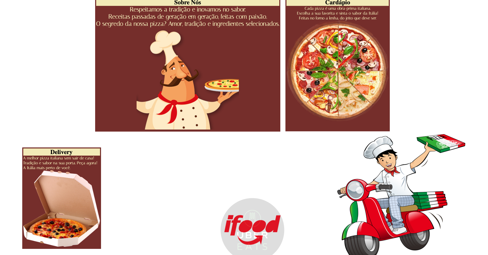
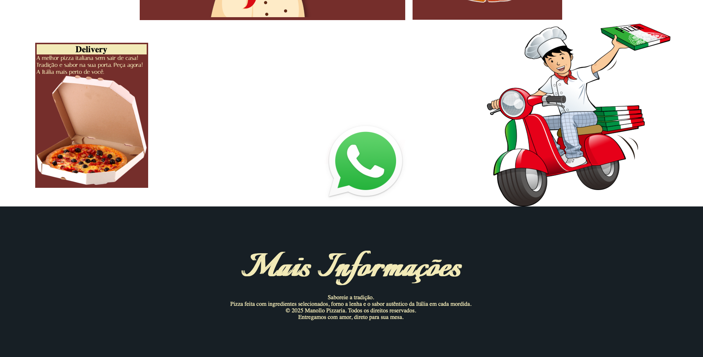
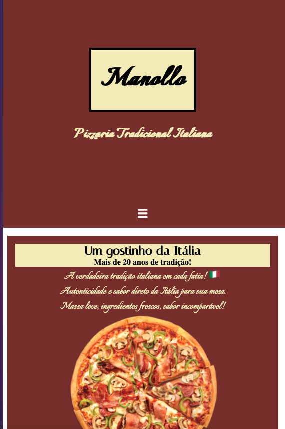
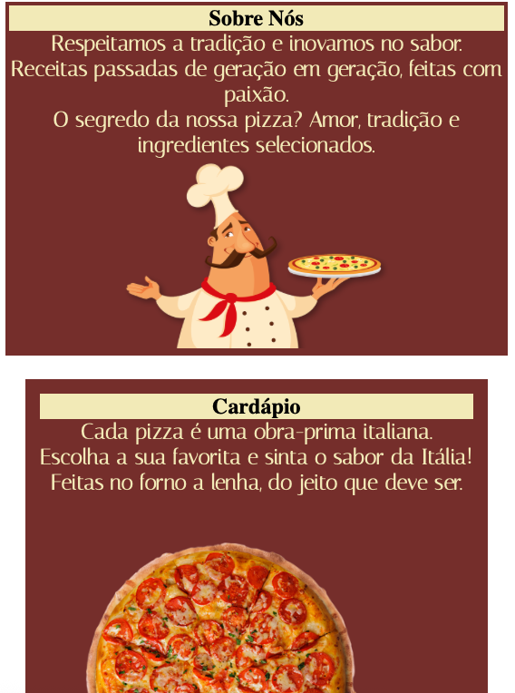

# 🍕 Site Responsivo de Pizzaria

Este projeto é um site front-end para uma pizzaria, desenvolvido com **HTML**, **CSS** e **JavaScript**, com foco em **responsividade**, **layout moderno com Flexbox** e **animações suaves** para uma experiência agradável tanto em desktop quanto em dispositivos móveis.

---

## 🔧 Funcionalidades

- ✅ Layout responsivo com media queries
- ✅ Menu de entrega animado
- ✅ Galeria de imagens com transições suaves
- ✅ Estrutura visual com Flexbox
- ✅ Compatibilidade com telas grandes e pequenas

---

## 🖼️ Pré-visualização

### 💻 Versão Desktop

#### 🧩 Header


#### 🧩 Body



#### 🧩 Footer


---

### 📱 Versão Mobile

#### 📲 Header


#### 📲 Body


#### 📲 Footer


---

## 🚀 Tecnologias utilizadas

- **HTML5**
- **CSS3** (Flexbox, animações, responsividade)
- **JavaScript** (básico)

---

## 📁 Estrutura do projeto

📦 pizzaria-site<br>
├── index.html<br>
├── style.css<br>
├── script.js<br>
└── imagens/<br>

## 💻 Como visualizar localmente

1. **Clone o repositório:**
   ```bash
   git clone https://github.com/LucasLeme102/pizzaria-site.git
   ```

2.**Acesse a pasta:**
   ```cd pizzaria-site```<br>

3.**Abra o arquivo index.html no navegador:**
```Clique duas vezes no arquivo index.html, ou use a extensão Live Server no VS Code para visualizar em tempo real.```


📌**Status do projeto**<br>
Projeto em desenvolvimento — melhorias contínuas sendo aplicadas.